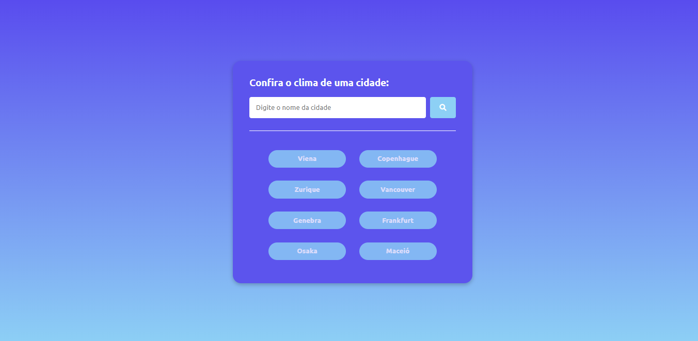

# Weather app

Projeto utilizando Apis mostrando o clima e tempo de cidades, o objetivo do projeto é teste de conhecimentos.

[ 📎 Clique aqui para acessar!]()

## 🔨 Ferramentas 
- HTML
- CSS
- JavaScript

## 📖 O que eu aprendi

Utilizando os conhecimentos de HTML e CSS para a estrutura do site e estilos, e JavaScript foi utilizando os links das Apis e usar keys(chaves) das Apis.

## Contato

Email 📩: joaovnerydurval@hotmail.com
Discord 🤖: Mr_Sulyvahn#7048